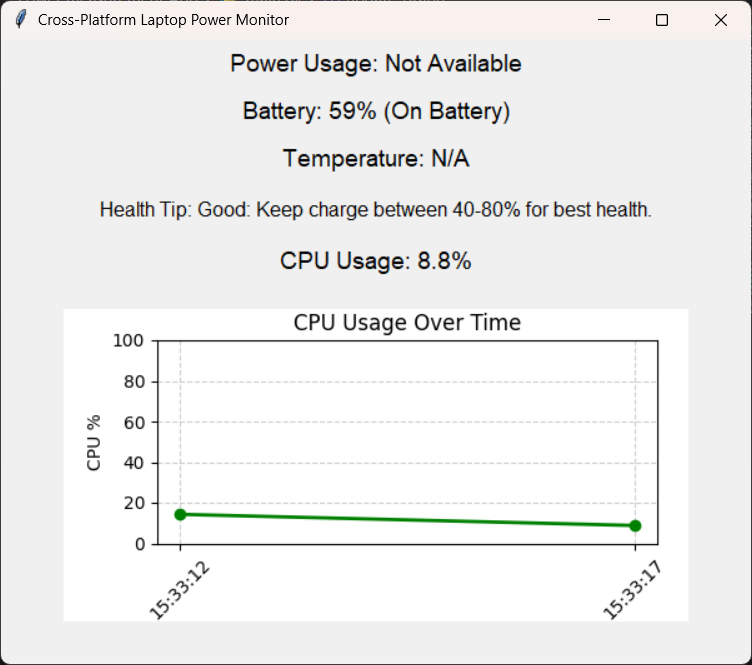

# ⚡ Laptop Power Monitor App

## 🖥️ Overview
The **Laptop Power Monitor** is a cross-platform Python application that provides **real-time monitoring** of key system metrics in a user-friendly graphical interface.  
It works on both **Windows** and **Linux** and gives you **insight into your laptop’s performance, battery health, and CPU usage**.

---

## ✨ Features
✅ **Battery Status**: Shows battery percentage and charging state.  
✅ **Power Usage (Linux)**: Displays real-time watt consumption using `upower`.  
✅ **CPU Usage**: Tracks CPU usage trends for performance awareness.  
✅ **Temperature Monitoring**:  
   - 🌐 **Linux**: Hardware temperature via system sensors.  
   - 🪟 **Windows**: CPU temperature via WMI (if available).  
✅ **Dynamic Health Tips**: Smart suggestions for better battery care.  
✅ **Interactive Graph**: Visualizes CPU usage trend over time.  
✅ **Overheat Alerts**: Warns if temperature exceeds **80°C**.  

---

## ⚙️ Installation

### 🪟 Windows:
```bash
pip install psutil matplotlib wmi
```

### 🐧 Linux:
```bash
sudo apt install upower
pip install psutil matplotlib
```

---

## ▶️ Usage
Run the application:
```bash
python main.py
```

---

## 📸 Screenshots


---


## 💻 Supported Platforms
- **🐧 Linux**: ✅ Full functionality (power usage, temperature, CPU usage, battery info).
- **🪟 Windows**: ✅ All features except exact wattage (due to OS limitations).

---

## ✅ Requirements
- Python 3.x  
- Tkinter (usually pre-installed)  
- psutil  
- matplotlib  
- **Linux only**: `upower` installed  
- **Windows only**: `wmi` library  

---

## 🔒 License
This project is **free for personal and educational use**.

---

💡 *Pro Tip*: Use this app while gaming, working, or traveling to keep your laptop cool and battery healthy! 🔋
